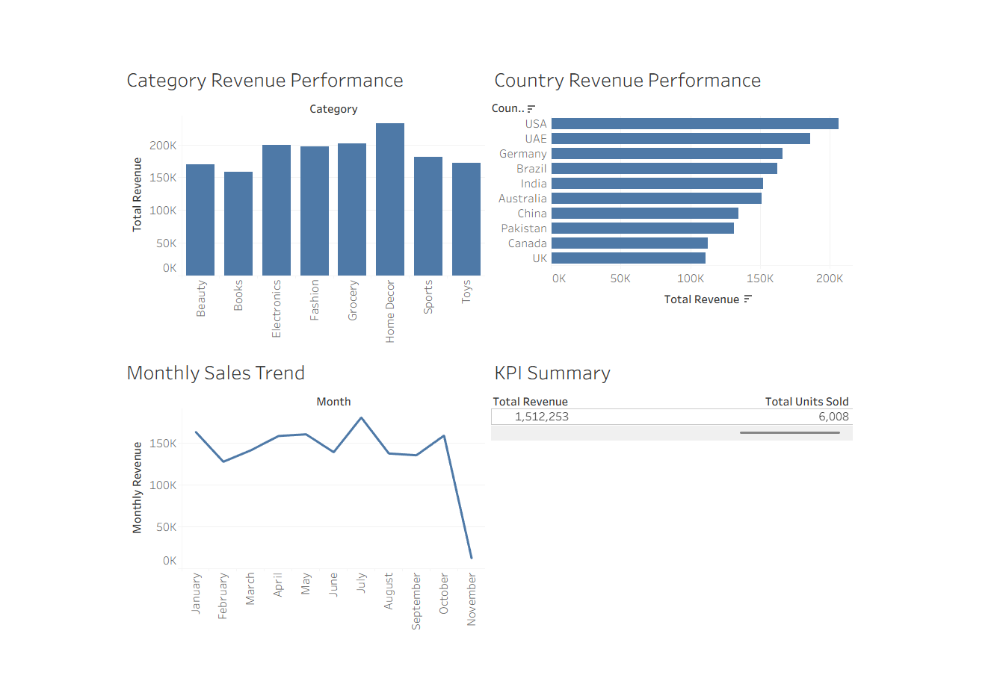

# Global E-commerce Sales Analytics using Snowflake and Tableau

## Project Overview

This project analyzes global e-commerce sales data using **Snowflake** for cloud-based data storage, cleaning, transformation, and analytical querying, and **Tableau** for interactive data visualization.

The objective is to identify sales trends, compare country and category performance, and provide a high-level overview of business revenue and sales activity.

## Business Objectives

* Analyze overall e-commerce revenue and sales volume.
* Identify the highest-performing product categories.
* Compare revenue performance across countries.
* Analyze monthly revenue trends.
* Create an interactive business intelligence dashboard.
* Demonstrate a complete data analytics workflow using Snowflake and Tableau.

## Technologies Used

* **Snowflake** — Cloud data platform and SQL analytics
* **Tableau Desktop** — Data visualization and dashboard development
* **SQL** — Data cleaning, aggregation, validation, and view creation
* **CSV** — Source dataset format

## Dataset Description

The dataset contains global e-commerce order information, including:

* Order ID
* Country
* Product category
* Unit price
* Quantity
* Order date
* Total amount

The dataset contains approximately 1,200 order records.

## Project Workflow

```text
CSV Dataset
    ↓
Snowflake Raw Table
    ↓
Data Cleaning and Type Conversion
    ↓
Analytical SQL Views
    ↓
Tableau Visualizations
    ↓
Interactive Sales Dashboard
```

## Snowflake Implementation

### Raw Data Table

The original CSV data was loaded into:

```text
ECOMMERCE_DB.ANALYTICS.ORDERS_RAW
```

### Cleaned Data Table

The cleaned data was stored in:

```text
ECOMMERCE_DB.ANALYTICS.ORDERS_CLEAN
```

Data preparation included:

* Trimming text fields.
* Converting the order date from text to a proper date type.
* Preserving numerical sales fields.
* Checking for missing values.
* Validating total amounts.

### Analytical Views

The following Snowflake views were created:

| View                      | Purpose                                                      |
| ------------------------- | ------------------------------------------------------------ |
| `VW_ECOMMERCE_KPIS`       | Overall revenue, orders, units sold, and average order value |
| `VW_MONTHLY_SALES`        | Monthly revenue, orders, and units sold                      |
| `VW_COUNTRY_PERFORMANCE`  | Country-level sales performance                              |
| `VW_CATEGORY_PERFORMANCE` | Category-level sales performance                             |

## Tableau Dashboard

The Tableau dashboard includes:

1. **Category Revenue Performance**
2. **Country Revenue Performance**
3. **Monthly Sales Trend**
4. **KPI Summary**



## Key Insights

* Home Decor generated the highest revenue among the product categories.
* The USA was the highest-performing country by revenue.
* July was one of the strongest months in the analyzed period.
* The dashboard provides a comparison of revenue performance across categories and countries.
* Monthly analysis helps identify changes in sales activity over time.

## Repository Contents

```text
global-ecommerce-sales-analytics/
│
├── Global_Ecommerce_Sales_Dashboard.twbx
├── ecommerce_analysis.sql
├── global_ecommerce_sales.csv
├── ecommerce_dashboard.png
└── README.md
```

## How to Reproduce the Project

1. Create a Snowflake database and schema.
2. Create the raw orders table.
3. Load the CSV dataset into Snowflake.
4. Run the data-cleaning SQL queries.
5. Create the analytical views.
6. Connect Tableau to Snowflake.
7. Build the visualizations using the analytical views.
8. Assemble the worksheets into a dashboard.

## Author

**Ashik Kannampilly Janardhanan**
